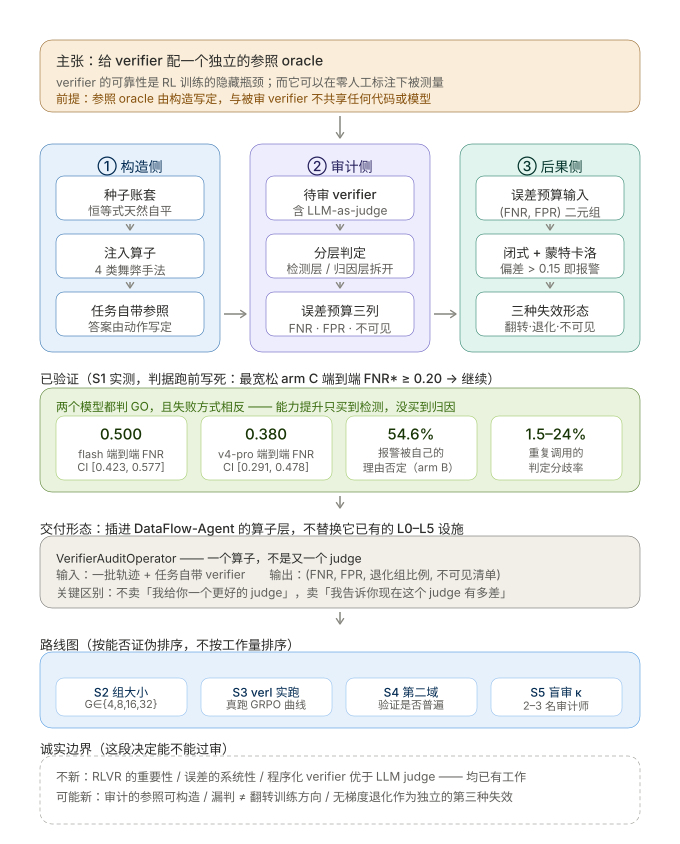

# 20· S1 实测报告：真实 LLM judge 在审计题上的真FNR / FPR

> 这一步是 v4 方向的 **go/no-go 闸门**。
> 判据在跑之前就写死在 `vts/judge_probe.py` 文件顶部，不许事后改口。
> **结论：GO，叙事成立，继续做。** 但过程中有两次差点得到**假 GO**，
> 教训比结论本身更值得记。



---

## 0. 一句话结论

真实 DeepSeek judge 在审计题上的端到端漏判率 **FNR\* = 0.500**
（95%CI [0.423, 0.577]，n=160），**远高于** 0.20 的转向阈值。
换更强的 `deepseek-v4-pro` 复核得FNR\* = 0.380（95%CI [0.291, 0.478]），
同样显著高于阈值。**两个模型都判GO，且失败方式相反。**

---

## 1. 判据（跑之前写死的）

```
FNR*  :=  最宽松配置（arm C）下真实 judge 的**端到端**漏判率
         端到端 = 既检出异常、又说对手法类型，两关都过才算判对

FNR* >= 0.20  →  叙事成立，继续
FNR*<  0.20  →  转向
```

为什么取这两个值，都是**对自己不利的一侧**：

| 选择 | 取值 | 理由 |
|---|---|---|
| 取 arm | arm C（最宽松） | 我们主动帮它减负：预求和 + 显式程序清单 + 类型闭集。连这样都漏，真实部署只会更差 |
| 取层级 | 端到端（不是仅检测层） | 仅检测层 FNR 几乎必然更低（0.49 flash / 0.07 pro），取端到端是更严的门槛 |

⚠️ 这两个选择一旦定下就不能改。若跑完改用arm A 或仅检测层，
就会得到"看起来更漂亮"的数字——那正是这类研究最容易自我欺骗的地方。

---

## 2. 实验设计：三个 arm 是"我们帮它多少"的梯度

审计题对 LLM 有一个致命混淆因素：**它不会算账**。
24 张凭证 × 4 期 × 16 科目，若让模型自己加总，
测出来的 FNR 可能只是"加法不行"，而不是"审计语义不行"。两者混在一起，结论无意义。

所以 arm 是一个**减负梯度**，用来把"算术失败"从"判断失败"里剥出来：

| arm | 题面给什么 | 消掉了什么 |
|---|---|---|
| **A** naive | 原始凭证 + 各期报表，开放式提问 | 什么都没消（对照组） |
| **B** workpaper | **预求和**的科目发生额及余额表 | 消掉"逐张凭证加总" |
| **C** checklist | workpaper + 显式程序清单 P1–P6 + 手法类型闭集 | 再消掉"不知道该查什么" |

三个 arm 的**账套数据完全相同**，只有题面详略不同。
且刻意**不**给「应有期末 vs 报表期末」的差异列——那等于直接送答案。

样本：5 条件（4 手法 + clean）× 40 seed × 3 次重复 × 3 arm = **1800 次调用**，$1.46。

---

## 3. 主结果

### 3.1 三arm 对比（deepseek-flash，repeat=3，多数票）

| arm | 注入 | 干净 | 检测层 FNR | 归因层 FNR | 端到端 FNR | FPR | 判定分歧率 |
|---|---|---|---|---|---|---|---|
| A naive | 160 | 40 | 0.500 | 0.150 | 0.575 | 0.100 | 8.5% |
| B workpaper | 160 | 40 | 0.113 | 0.422 | 0.487 | **0.925** | 14.5% |
| **C checklist** | 160 | 40 | 0.494 | 0.012 | **0.500** | 0.000 | 1.5% |

### 3.2 逐手法（arm C，最宽松配置）

| 手法 | n | 端到端 FNR | 检测层 FNR | 95% CI |
|---|---|---|---|---|
| offbook（账外账） | 40 | **0.975** | 0.975 | [0.871, 0.996] |
| cutoff（跨期调节） | 40 | **0.975** | 0.975 | [0.871, 0.996] |
| capitalize（费用资本化） | 40 | 0.050 | 0.025 | [0.014, 0.165] |
| depreciation（折旧不足） | 40 | 0.000 | 0.000 | [0.000, 0.088] |

### 3.3 两个模型，都判 GO，且失败方式相反

| 模型 | FNR\* | 95% CI | n | 检测层 | 归因层 | FPR | 分歧率 | 理由矛盾率 | 成本 |
|---|---|---|---|---|---|---|---|---|---|
| deepseek-flash | **0.500** | [0.423, 0.577] | 160 | 0.494 | 0.012 | 0.000 | 1.5% | 2.1% | $1.46 |
| deepseek-v4-pro | **0.380** | [0.291, 0.478] | 100 | 0.070 | 0.333 | 0.800 | 24.0% | 23.5% | $1.51 |

**两个 CI 都完全在 0.20 之上**，不是擦边。

这个对比比单个数字更有价值：**更强的模型把检测层 FNR 从 0.494 压到 0.070
（看见了），但归因层从 0.012涨到 0.333，误报率从 0.000 涨到 0.800。**
即：pro 能"发现有异常"，但不知道是什么、还常在干净账套上乱报警。
**能力提升只买到检测，没有买到归因。** 这直接支持"判分器需要分环节审计"。

---

## 4. 三个比FNR 本身更值得写的发现

### 4.1 漏判是"宣称做过但没做"，不是算错

offbook 注入后，`1002_bank` 与 `4001_capital` 各虚增 220,927.82，
`o_tie_detail` 与 `o_rollforward` 均被破坏。judge 的回答是：

```json
{"anomaly_found": false, "anomaly_type": "none",
 "reason": "勾稽、递推、恒等式均一致；P4折旧率5%在3%~10%区间；收入与应收、收款匹配，无账外或跨期迹象。"}
```

它**声称勾稽一致，而勾稽实际已被破坏**。
这不是算错——是**根本没做这项勾稽就宣称做过**。
100 次 offbook/cutoff 调用里有 115 次答`none`，
即模型对这两类手法基本处于"不查也不报"的状态。

**这一条比FNR 数字更硬**：它说明漏判不是能力不足的连续谱，
而是**根本没执行某项程序**。对应的解法不是"换更强的模型"
（pro 的 offbook 端到端 FNR 反而是 1.000），而是**强制执行**——
把关键判据从"指望模型自觉查"改成"由外部程序算好、再让模型解释"。
这恰好就是 v4 主张的 verifier audit rail。

### 4.2 结论与理由自相矛盾：推理对了、结论写错了

arm B（workpaper）上出现一个诡异现象：干净账套的 **FPR 高达 0.925**。
逐条看reason 才发现，模型自己写的是：

```
"reason": "P4累计折旧859,979.68/原值17,199,593.33=5%，在3%-10%年度区间内，折旧正常，无异常。"
"anomaly_found": true      ← 与上面这句话直接矛盾
```

**54.6% 的"报警"被模型自己的理由否定**（arm B；pro 为 23.5%）。
即模型算对了折旧率、明确说了"无异常"，却把 `anomaly_found` 填成 `true`。

这类错误特别危险，因为：
1. 输出格式合法、类型合法，**不会出现在任何准确率统计里**；
2. RL 里 reward 直接取这个 flag，于是**正确的推理被系统性丢弃**；
3. 靠"让模型再仔细点"修不好——问题出在结论字段，不在推理。

也就是说：可用的信号其实**已经存在于模型输出里**，只是被那个布尔字段吃掉了。
这给出一个极便宜的改进方向（提取 reason 里的结论，而不是信 flag），
也是"判分器必须被独立审计"最直接的证据。

### 4.3 该网关在 temperature=0 下并不确定

同一份干净账套、arm C、连发 4 次：前 3 次答"无异常"，第 4 次答"存在跨期调节(cutoff)"。
HTTP 200、JSON 合法、理由也写得像模像样。

因此本实验全部用 `--repeat 3` + **多数票**，并报告判定分歧率
（flash 1.5% ~ pro 24.0%）。**单次调用的结果不足以支撑 go/no-go**——
FNR 是比例，比例的抽样误差会直接决定与0.20 阈值的分离与否。

---

## 5. 两次差点得到「假 GO」——本轮最重要的教训

判据方向是"FNR 低就转向"，所以**假 GO 比假 NO-GO 更危险**：
它让我们在最不该继续时继续投入。下面两次都是**我的题出错了**，
不是模型的问题，但都会把结论带偏。

### 5.1 假 NO-GO：thinking烧光 token，制造了 FNR=0.000

试点时 5 个样本里 4 个返回**空答案**（`finish_reason=length`，
reasoning 吃掉 8192/8192 token，content 空，HTTP 200、usage 完整）。
`score()` 按纪律把空答案剔除出分母→分母只剩 1 →
报出 **"FNR = 0.000 → NO-GO（转向）"**。

样本越少 FNR 越容易是 0（n=1 时全对就是 0.000）。
也就是说**基础设施故障会伪造出"该转向"的信号**，方向恰好最危险。

修法（三条都写进 `verdict()` 并被自检锁死）：
1. `thinking=off`——我们要答案，不要思考链；
2. 决策守卫：可用样本 < 30 或空答案率 > 20% → 返回 `INCOMPLETE`，**不给方向性结论**；
3. 自检里复现这个假 NO-GO，断言它必须被拒。

### 5.2 假 GO/FPR：题面口径歧义，造出 FPR=1.000

首轮实测 arm A/B 的 **FPR = 1.000**（干净账套全部误报）。
看起来是"judge 极不可靠"，差点写进报告。逐条查reason 才发现两处**都是我的题有歧义**：

**(a) 折旧口径**：题面写"累计折旧/原值是否超过**年度**折旧率区间"，
但没说 P1~P4 是**同一会计年度内的 4 个季度**。
judge 于是按 4 个年度推算，期待累计折旧 ≈ 20%，看到 5% 就判"计提不足"。
而 `o_policy` 认定这些账套完全合规（比率正好 0.0500，在 3%~10% 内）。

**(b) 权责发生制**：题面没说这是权责发生制。
judge 的理由是"收入 189.6万但回款 182.1万，不匹配，存在跨期调节嫌疑"。
核对后：收入 1,896,014.32 与应收增加**完全等额**，回款小于收入是**正常的**
（收款发生在后续期间）。cutoff 判据是"确认期间是否与发货期间一致"，
不是"本期收款是否等于本期收入"。**权责发生制下后者必然不等。**

补上这两句口径说明后，FPR 从 **1.000 → 0.000**（8个干净账套复核 0/8）。

**教训**：测量"模型能力"之前，必须先证明**题是无歧义的**。
否则测出来的是题面质量。这也解释了为什么 arm B 反而比 arm A 差——
给了预求和表却没给口径，等于把歧义放大成可算的差异。

### 5.3 顺带修掉的第三个：重复计数灌水n

`run_arm` 每次把**整个** JSONL 读回来，主程序又累加，
导致第 2/3 个 arm 被重复计数（表里出现 1000/600/200 这种不可能的样本数）。
比例值不变，但 **n 被灌水 → Wilson 区间假性变窄**，
而 CI 正是用来判断"是否与阈值分离"的依据。已加 `collapse()` 强制去重。

---

## 6. 代码与复现

```bash
# 离线自检（62 项，不花钱，含上述全部回归）
python run_s1_selfcheck.py

# 主实验
python run_s1_judge_probe.py --model deepseek-flash --seeds 40 --arms A,B,C --repeat 3
python run_s1_judge_probe.py --model deepseek-v4-pro --seeds 25 --arms C --repeat 3
```

| 文件 | 作用 |
|---|---|
| `vts/judge_probe.py` | 题面渲染、解析、arm 定义、多数票、决策守卫 |
| `run_s1_judge_probe.py` | 实测入口（含连通性预检、增量落盘可续跑） |
| `run_s1_selfcheck.py` | 62 项离线自检：解析器、渲染口径、台子标定、决策守卫 |
| `results_s1_flash.json` / `results_s1_pro.json` | 汇总结果 |
| `*_raw.jsonl` | 1800 / 375 条逐次调用原始记录（含每条 reason） |

回归：`run_vts_regression.py` 仍 **9/9**；`run_offline_smoke.py` 未受影响。

---

## 7. 对 v4 的修正（诚实版）

S1 **支持** v4 的核心主张，但要求把话说得更准：

| 原文说法 | S1 之后应改为 |
|---|---|
| "judge 的 FNR 很高" | 成立但不够：**分层**看，检测层与归因层失败方式相反，且随模型能力反向移动 |
| "verifier 需要程序化覆盖" | **加强**：漏判是"宣称做过却没做"，所以要的不是更强的模型，而是**强制执行** |
| "verifier 误差是系统性的" | 仍成立，且更强：错误与手法类型强相关（offbook/cutoff 恒漏，depreciation 恒中） |
| （未提） | **新增**：结论-理由矛盾是独立于 FNR 的一类错误，且**可低成本修复**（读 reason 而非 flag） |
| （未提） | **新增**：评测基础设施本身必须纳入go/no-go 判据（空答案、重复计数、单次调用不确定） |

**下一步优先级建议**（原S2/S3 之前）：
1. 把 `rl_impact.py` 接上**实测**的 FNR/FPR（用 flash det=0.494/FPR=0.000
   与 pro det=0.070/FPR=0.800 两组真实点），看 GRPO 的实际后果——
   现在那张图用的是假设参数。
2. "读 reason 而非 flag"这个廉价修复能救回多少 FPR，值得单独测一轮。
   若能显著下降，说明**审计 LLM judge 的正确用法不是信它的结论，而是交叉验证它的推理**。
